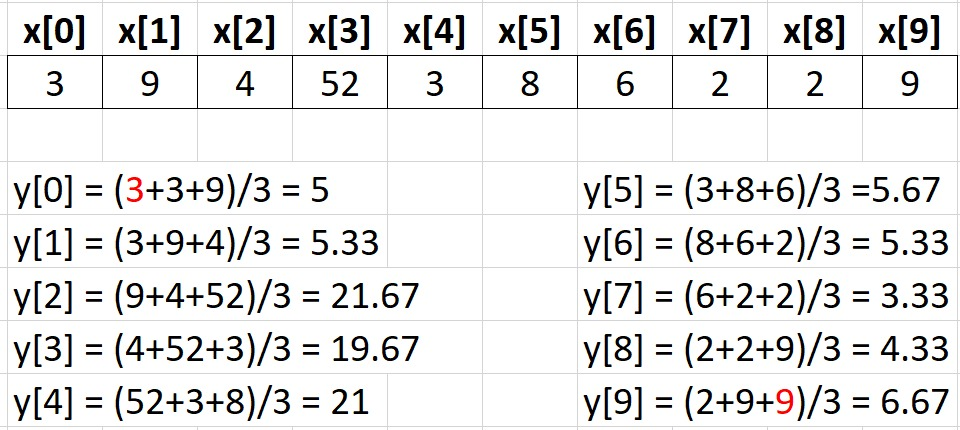
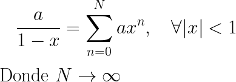

# IEE240 - Laboratorio 2

## Instrucciones:
- Los archivos para el desarrollo del problema 1 se encuentran dentro de la carpeta `pregunta1`. Debe codificar la función en ensamblador (para Intel de 64 bits) del problema 1 en el archivo `avgFilterASM.asm`. Además, completar el archivo `preg1.c` con las indicaciones del enunciado del problema 1.

- Los archivos para el desarrollo del problema 2 se encuentran dentro de la carpeta `pregunta2`. Debe codificar la función en ensamblador (para Intel de 64 bits) del problema 2 en el archivo `geometricSerieASM.asm`. Además, completar el archivo `preg2.c` con las indicaciones del enunciado del problema 2.

- Los programas bash `preg1.sh` y `preg2.sh` son referenciales y sirven para propósitos de ejecución dentro de GitHub. Validar el funcionamiento de sus programas utilizando correctamente `nasm` y `gcc` en su ambiente de trabajo.

- **La prueba inicia a las 8:10 pm y termina a las 10:00 pm. El sistema (GitHub Classroom) cierra a las 10:05pm, no se calificarán entregas (`push`) luego de esa hora.**

- **En caso se detecte plagio en alguno de sus códigos, se iniciará el proceso correspondiente definido por la Facultad de Ciencias e Ingeniería.**

- **Las funciones a implementar en lenguaje ensamblador deben seguir las reglas definidas por "GCC Calling Conventions". En caso de no hacer uso correcto, se descontará puntaje de su solución** 

- **Para el correcto funcionamiento de sus programas, debe completar todo lo que se pide en los enunciados y los comentarios FIXME dentro de los programas principales `preg1.c` y `preg2.c`**

- **En caso utilice la instrucción UCOMISS para comparar los registros XMM, debe utilizar las instrucciones de salto condicional JA o JB según sea necesario por las banderas que modifica.**
Una lista completa la puede revisar en el siguiente enlace: http://www.penguin.cz/~literakl/intel/j.html

## Problema 1 (10 puntos):
El filtro promedio móvil es un algoritmo que permite "suavizar" una señal discreta eliminando variaciones bruscas que se puedan presentar. La implementación del algoritmo requiere un arreglo de números reales que corresponden a la señal de entrada y la señal/arreglo de salida se forma calculando la media aritmética de los valores en las posiciones `n`, `n-1`, y `n+1` de forma iterativa. La siguiente imagen muestra el desarrollo del algoritmo para un arreglo de entrada de 10 elementos. 

**IMPORTANTE: Para los extremos del arreglo, repetir el valor del centro (posición `n` - valores en color rojo)**


Se le pide lo siguiente:

- Completar la función en C `avgFilter` que implemente el algoritmo descrito en la imagen. Para ello, considerar que el vector `x` es un arreglo de números reales aleatorios cuyo tamaño es ingresado por el usuario al ejecutar el programa. Por ejemplo, para `1024` elementos, el usuario debe ingresar lo siguiente:
```
$ ./preg1 1024
```
- Implementar la función `avgFilterASM` en lenguaje ensamblador para Intel de 64 bits que desarrolle el algoritmo descrito en la imagen anterior. El prototipo de esta función debe ser igual al prototipo de la función desarrollada en C.

- Finalmente, el programa principal `preg1.c` debe medir los tiempos de ejecución de ambas funciones e imprimir el speed-up de su implementación en lenguaje ensamblador respecto a su implementación en C. Colocar en comentarios el speed-up obtenido en la segunda ejecución de su programa para los siguientes tamaños de arreglo: `512`, `1024`, `2048`, y `4096`.

**NOTA: para la generación de números aleatorios, utilizar la función en C: genRandomValues(). Revisar el prototipo de la función en el archivo `preg1.c`**

## Problema 2 (10 puntos)
El valor de `a/(1-x)` se puede aproximar a una serie geométrica real la cual converge siempre y cuando se cumpla la siguiente ecuación:



Por ello, se desea codificar un programa que reciba las variables `a`, `x` y `N` por terminal, así como las funciones en C y ASM que permitan realizar el cálculo aproximado de `a/(1-x)` mediante la sumatoria de las potencias de `x` para todo `|x|<1`.

Se le pide lo siguiente:

- Completar la función en C `geometricSerie` del programa `preg2.c`. Esta función debe tener como parámetors de entrada los valores a, x y N.

- Implementar la función `geometricSerieASM` en lenguaje ensamblador para Intel de 64 bits que realice el mismo procedimiento descrito anteriormente. El prototipo de esta función en lenguaje ensamblador debe ser igual al prototipo de la función desarrollada en C.

- Completar el programa principal `preg2.c`. Este programa debe calcular los tiempos de ejecución de las funciones de C y ASM y brindar el valor de speed-up, así como la diferencia con el cálculo directo de la fracción tal como se muestra en la siguiente impresión:
```
$ La diferencia utilizando la funcion en C es de 0.0001
$ La diferencia utilizando la funcion en ASM es de 0.0001
$ El speed-up es 2.00
```
- Adicionalmente, en caso de que el usuario ingrese un valor de `x` no válido, las funciones deben retornar un indicador para que el programa principal imprima lo siguiente:
```
$ Error: por condicion de desigualdad no se acepta x.
```

A modo de ejemplo, si se ingresa `x = 0.2`, `a = 3`, y `N = 100` se debe visualizar el terminal de la siguiente manera:
```
$ ./preg2 0.2 3 100
$ La diferencia utilizando la funcion en C es de 0.0000
$ La diferencia utilizando la funcion en ASM es de 0.0000
$ El speed-up es 2.00
```
**NOTA: El valor de speed-up es referencial. Depende de su computadora y su implementación**

Por otro lado, si se ingresan los valores `x = 10`, `a = 3`, y `N = 100` el terminal mostrará lo siguiente:
```
$ ./preg2 10 3 100
$ Error: por condicion de desigualdad no se acepta x.
```
- Finalmente, colocar en comentarios el speed-up obtenido en la segunda ejecución de su programa para los siguientes valores de `N`: `512`, `1024`, `2048`, y `4096`.

- Como ejemplo de prueba, se sugiere observar el archivo bash `preg2.sh` el cual contiene los valores de `x`, `a`, y `N` de prueba para `x = 0.2`, `a = 3`, y `N = 100`

## Subir solución a GitHub.
Al terminar el laboratorio y luego de validar localmente la correcta ejecución de su programa, realizar un `push` de su solución a su laboratorio para su corrección. Para ello ejecute los siguientes comandos en un Terminal de Linux. **NOTA:** Los comandos a continuación debe ejecutarlos dentro de la carpeta `<carpeta-del-repositorio>`.

- Verificar con el siguiente comando que se han modificado los archivos correctos. Debería aparecer en rojo los archivos modificados.
```
$ git status
```
- Para añadir los archivos a git:
```
$ git add .
```
- Para subir sus códigos al repositorio remoto (GitHub):
```
$ git commit -m "<ponga-aqui-un-comentario-util>"
$ git push origin master
```
- Finalmente revisar su nota en la página web del repositorio. Cualquier consulta comuníquese con su JP.
