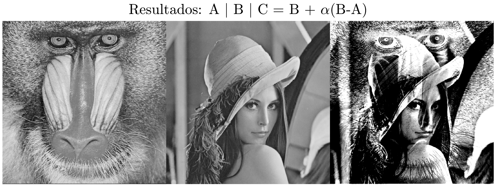

# IEE240 - Laboratorio 4 - Instrucciones:
- Los archivos para el desarrollo del problema se encuentran dentro de la carpeta `codes`. Debe codificar la función en ensamblador (para Intel de 64 bits) en el archivo `effectASM.asm` y `effectSIMD.asm`. Además, completar el archivo `preg.c` con las indicaciones del enunciado del problema.

- El programa bash `test.sh` es referencial y puede modificarlo para su correcto funcionamiento. Validar la ejecución de sus programas en su ambiente de trabajo.

- **La prueba inicia a las 8:10 pm y termina a las 10:00 pm. El sistema (GitHub Classroom) cierra a las 10:10pm, no se calificarán entregas (`push`) luego de esa hora.**

- **En caso se detecte plagio en alguno de sus códigos, se iniciará el proceso correspondiente definido por la Facultad de Ciencias e Ingeniería.**

- **Las funciones a implementar en lenguaje ensamblador deben seguir las reglas definidas por "GCC Calling Conventions". En caso de no hacer uso correcto, se descontará puntaje de su solución**

- **Para el correcto funcionamiento de sus programas, debe completar todo lo que considere apropiado. El programa `preg.c` contiene solo el código necesario para la lectura y escritura de imágenes**

# Problema (20 puntos)
La ecuación a continuación permite procesar dos imágenes (`A` y `B`) y obtener el efecto mostrado en la Figura 1 (imagen `C`). 
```
C = B + alpha * (B - A)
```


**Figura 1:** Imágenes `A` y `B` para el desarrollo del laboratorio y resultado esperado (`C`).

- Implementar una función en lenguaje C que permita obtener la imagen `C` según la ecuación definida al incio del enunciado. Codificar su función dentro del programa `preg.c`.
- Codificar una función en ASM (archivo `effectASM.asm`) que permita obtener la imagen `C` según la ecuación definida al inicio del enunciado. El prototipo de esta función debe ser igual al prototipo de la función implementada en lenguaje C.
- Codificar una función en ASM-C (haga uso del archivo `effectSIMD.asm` para la parte en lenguaje ensamblador) que permita obtener la imagen `C` según la ecuación definida al inicio del enunciado. Debe hacer uso de las instrucciones para operaciones vectoriales de la unidad SIMD. 

- Consideraciones:
    - La imagen es una arreglo de enteros de 1 byte en memoria RAM. Sus valores están en el rango `[0 - 255]`.
    - El parámetro `alpha` debe ser ingresado por línea de comandos. 
    - La imagen resultante de cada una de las tres funciones a codificar debe guardarse en un archivo diferente. Modificar el código en `preg.c` para cumplir esta condición.
    - Para la verificación de sus implementaciones, utilizar un valor de `alpha = 1.75`.
    - Modificar el archivo `test.sh` para poder verificar el funcionamiento de sus códigos ejecutando la siguiente línea:
```
$ bash ./codes/test.sh
```
- Considerando que su función en lenguaje C es su referencia, calcule el speed-up relativo de su implementación en ASM. Utilizar la función `clock_gettime()` para la medición de tiempos.
- Considerando que su función en lenguaje C es su referencia, calcule el speed-up relativo de su implementación en ASM utilizando la unidad SIMD. Utilizar la función `clock_gettime()` para la medición de tiempos.
- Considerando que su función en lenguaje ensamblador es su referencia, calcule el speed-up relativo de su implementación en ASM utilizando la unidad SIMD. Utilizar la función `clock_gettime()` para la medición de tiempos.
- Utilizando la ley de Amdahl, ¿cuál de las dos mejoraras tiene un mejor overall speed-up? Justificar.

**NOTA: las métricas de speed-up y tiempos deben imprimirse y las respuestas adicionales colocarse dentro del archivo `preg.c` como comentarios. Para el cálculo de la fracción de mejora, puede reportar las mediciones como comentarios.**

# Subir solución a GitHub Classroom para revisión.
Al terminar el laboratorio y luego de validar localmente la correcta ejecución de su programa, realizar un `push` de su solución a su repositorio para su corrección. Para ello ejecute los siguientes comandos en un Terminal de Linux. **NOTA:** Los comandos a continuación debe ejecutarlos dentro de la carpeta `<carpeta-del-repositorio>`.

- Verificar con el siguiente comando que se han modificado los archivos correctos. Debería aparecer en rojo los archivos modificados.
```
$ git status
```
- Para añadir los archivos a git:
```
$ git add .
```
- Para subir sus códigos al repositorio remoto (GitHub):
```
$ git commit -m "<ponga-aqui-un-comentario-util>"
$ git push 
```
Cualquier consulta comuníquese con su JP.
